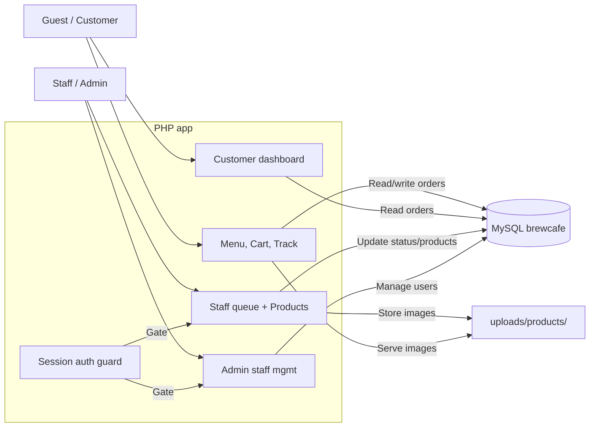

# BrewCafe

> Guest-first coffee ordering for pickup: browse the menu, check out without an account, track with a `BC-XXXX` code, pay at the counter.


## Tech Stack

| Area | Technology |
| --- | --- |
| Runtime | PHP (server-rendered, no framework; dev environment in dump header: PHP 8.2.12) |
| Database | MySQL / MariaDB via MySQLi (`brewcafe` database; dump reports MariaDB 10.4.32) |
| UI | PHP templates + Tailwind CSS Browser CDN v4, Google Fonts, Lucide icons |
| Auth | PHP sessions, `password_hash` / `password_verify`, role checks (`customer`, `staff`, `admin`) |
| Storage | Local product images in `uploads/products/` (JPG/PNG, max 2 MB) |

## Overview

BrewCafe is a small pickup-ordering app for a coffee shop. Guests can order without signing up; registered customers get faster checkout plus order history and one-click reorder. Staff work an order queue (`pending → preparing → ready → completed`, plus `cancelled`); admins manage staff accounts. Payment is always at the counter — the app tracks `unpaid` / `paid`, marking `paid` when an order is completed.

Shop hours shown in the app footer: Mon–Sat 7:00–19:00, Sun 8:00–17:00.

## Features

- Guest ordering: searchable menu, category filter, session cart (max 20 per item), checkout with name + PH phone (`09XXXXXXXXX` or `+639XXXXXXXXX`, normalized server-side).
- Pickup codes: unique `BC-XXXX` code per order, shown on the success page and used for tracking.
- Order tracking: guests enter code + phone; signed-in customers open their own orders with the code only. Progress bar (Queued → Brewing → Ready → Done) plus cancelled state.
- Customer dashboard: last 20 orders with line items, reorder (only currently available items are re-added), links into tracking.
- Staff queue: all orders sorted `pending → preparing → ready → completed → cancelled`, filter by code/name/phone, Advance / Cancel actions.
- Product management (staff/admin): create/edit/hide/show/delete drinks with price, category, description, and optional image upload. Deletes keep past order lines via name/price snapshots.
- User management (admin only): create staff accounts, enable/disable staff, reset staff passwords. Public signup creates `customer` accounts only.
- Role enforcement: staff/admin accounts cannot place or track orders; guests and customers cannot reach staff/admin pages (session guard + 403 page).

## Architecture



Browser pages in `customer/`, `staff/`, `admin/`, `track.php`, and `index.php` call MySQL through `config/database.php` + `include/helpers.php` (escaping, phone normalization, code generation, cart count). `include/auth_guard.php` owns sessions and role checks. Tables: `users`, `menu_items`, `orders`, `order_items` (see `brewcafe.sql` for the exact schema).

## Getting Started

### Prerequisites

- XAMPP (Apache + MySQL/MariaDB + PHP). The included dump was exported with phpMyAdmin 5.2.1 against MariaDB 10.4.32; any recent XAMPP with PHP 8.x should run the code.
- A browser. No build step, no Composer/NPM dependencies to install.

### Installation

```bash
git clone https://github.com/shanshan-3/coffee-ordering-system.git
```

Then place (or keep) the project so it is served as `http://localhost/ordering-system/` (e.g. `C:\xampp\htdocs\ordering-system`). The app uses absolute paths under `/ordering-system/`, so the folder name matters.

### Database setup

1. Start Apache and MySQL in XAMPP.
2. Create the database: `CREATE DATABASE brewcafe;`
3. Import `brewcafe.sql` from the repository root — via phpMyAdmin (Import tab), or:
   ```bash
   mysql -u root brewcafe < brewcafe.sql
   ```
   This creates `users`, `menu_items`, `orders`, `order_items` with keys/constraints, plus sample menu items. Note: sample `image_url` paths in the dump (`uploads/coffee/…`, `uploads/frappe/…`) are sample data; new uploads go to `uploads/products/`.
4. Make `uploads/products/` writable by PHP so product images can be saved.

### Configuration

`config/database.php` is gitignored (local-only). Recreate it with your own values — never commit real credentials:

```php
$host = '';
$database = '';
$username = '';
$password = '';
```

Defaults used during development were host `localhost`, database `brewcafe`, user `root`, empty password. Point the file at your local MySQL/MariaDB instance.

### Run locally

1. Start Apache + MySQL in XAMPP.
2. Open `http://localhost/ordering-system/` (landing), `http://localhost/ordering-system/customer/menu.php` (order), `http://localhost/ordering-system/track.php` (track a `BC-XXXX` order).
3. Staff sign in at `http://localhost/ordering-system/auth/signin.php`, then use Queue (`staff/orders.php`), Products (`staff/products.php`), and — admins only — Staff (`admin/staff.php`).

## Project Structure

```text
admin/staff.php          Admin: create/disable staff, reset passwords
auth/signin.php          Sign in (all roles, active-check, redirect by role)
auth/signup.php          Public signup — customer accounts only
auth/signout.php         Sign out
config/database.php      Local MySQL connection (gitignored, recreate per machine)
customer/menu.php        Menu search/filter + add to cart (staff see view-only)
customer/cart.php        Cart edit + guest/customer checkout → BC-XXXX code
customer/dashboard.php   Customer order history + reorder
customer/success.php     Order confirmation with pickup code
include/auth_guard.php   Sessions, currentRole/isStaff/requireRole/redirectByRole
include/helpers.php      esc, imageUrl, phone normalize, order-code gen, cart count
include/header.php       Tailwind CDN, fonts, shared card/button/input styles
include/navbar.php       Role-aware nav (Menu/My Orders/Track vs Queue/Products/Staff)
staff/orders.php         Order queue, filter, advance/cancel transitions
staff/products.php       Product CRUD + image upload (JPG/PNG ≤ 2 MB)
brewcafe.sql             Schema + sample data for the `brewcafe` database
index.php                Landing page (menu/track entry points)
track.php                Guest + customer order tracking
uploads/products/        Product image uploads (gitignored contents)
```

## Usage

- Guest: Menu → Add to cart → Cart → enter name + phone → Place pickup order → save the `BC-XXXX` code → Track → pay at counter on pickup.
- Customer: same as guest (name prefilled), plus My Orders → View (jumps to tracking) or Reorder.
- Staff: sign in → Queue → Advance (`pending → preparing → ready → completed`, which also flips `unpaid → paid`) or Cancel. Manage the menu in Products.
- Admin: sign in → Staff → create staff (name + valid email + 6+ char temp password), disable/enable, reset passwords.

## Testing

No automated test suite is included (no test config, scripts, or CI workflows were found). Verify manually: guest checkout with an invalid then valid phone, tracking with code + phone, a staff advance through all states, and a product image upload over 2 MB (should be rejected).

## Deployment

No deployment target is configured in the repo (no Docker, Compose, CI, or hosting config). It is a local XAMPP app; any production move would need its own Apache/PHP + MySQL hosting, secret management for `config/database.php`, and HTTPS — none of which is defined here.

## Security

- All database access uses MySQLi prepared statements; output is escaped via `esc()`.
- Passwords stored with `password_hash`, verified with `password_verify`; deactivated accounts (`is_active = 0`) cannot sign in.
- Role gates on every staff/admin page plus checkout/track guards; public signup can never create `staff`/`admin`.
- Uploads validated by size (2 MB), real image check (`getimagesize`, JPEG/PNG only), random filenames under `uploads/products/`; path traversal and remote-URL deletes are guarded.
- `config/database.php` and uploaded product images are gitignored. The dump contains sample accounts and password hashes — do not reuse them outside local development.
